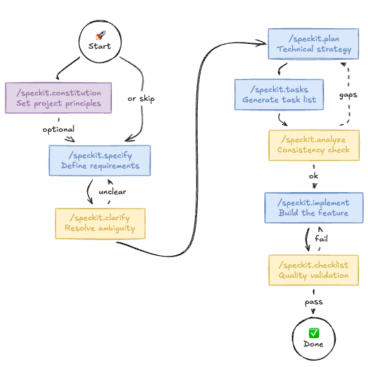
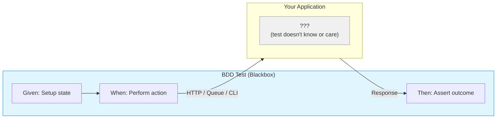

S1
# Spec-Driven Development with AI Agents

**Speaker**: Ali Reza Yahya
**Duration**: ~15-20 minutes

---

S2
## ACT 1: The Skeptic

S3
### Opening: The Promise vs Reality

> "AI will write all your code!"
> "Just describe what you want!"
> "10x developer productivity!"

**The Hype**: Everyone's talking about AI-assisted development. Copilot, ChatGPT, Claude—they're supposed to revolutionize how we build software.

S4
### My Initial Experience

S4.1
**What I expected**: Describe a feature → Get working code → Ship it

**What actually happened**:
- AI was great for PoC, quick prototypes, exploring ideas
- But when it came to real implementation... I ended up writing all the code myself
- Spent more time fixing AI output than it would take to write it from scratch
- AI became a "PoC machine" — useful at the start, then sidelined

S5
### "But what about CLAUDE.md?"

S5.1
Yes, context files help. CLAUDE.md, project instructions, system prompts...

S6
**The reality**:
- They help AI understand the codebase better
- But they don't **guarantee** consistency
- AI still makes different decisions each session
- Same problem, three conversations, three different approaches

S6.1
### The Core Problems

1. **No guarantees** — Context files improve odds, but inconsistency still creeps in
2. **Context isn't constraint** — AI knows the patterns but doesn't enforce them
3. **Inconsistency compounds** — Over time, codebase becomes a patchwork of styles
4. **The fix-or-rewrite dilemma** — Is it faster to fix AI output or just write it myself?

**My conclusion at the time**: "AI is a PoC tool. Great for exploration, but I'll write the real code myself."

---

S7
## ACT 2: The Turning Point

### The Question

What if the problem isn't the AI—it's how I'm using it?

S8
### What AI Actually Does Well

S8.1
1. **Executing specific instructions**
   - "Change function name from `getUserData` to `fetchUserProfile` in `src/api.ts`"
   - "Add error handling to this function" (with the function provided)
   - Precise task → Precise output

S8.2
2. **Reading existing codebase and translating**
   - "Explain what this function does"
   - "How does this module handle errors?"
   - "Summarize the authentication flow in this codebase"
   - AI is great at digesting existing code and explaining it in your language

S8.3
3. **Yapping**
   - "You're absolutely right!"
   - "That's a great question!"
   - "Excellent point!"
   - *(At least it's enthusiastic about agreeing with you)*

S9
### What AI Doesn't Do Well

S9.1
1. **Vague prompts**
   - "Make this code better"
   - "Build me an authentication system"
   - No constraints = AI makes assumptions = inconsistency

S9.2
2. **Big, complex codebases**
   - Too much context to hold
   - Loses track of relationships between components
   - Makes locally-sensible but globally-wrong decisions

S9.3
3. **Code noise / large input context**
   - More input ≠ better output
   - AI gets distracted by irrelevant details
   - Signal-to-noise ratio matters

S10
### The Insight

| AI Strength | AI Weakness |
|-------------|-------------|
| Specific instructions | Vague prompts |
| Focused context | Large/noisy context |
| Transforming existing info | Creating from nothing |

**The question becomes**: How do I give AI more of what it's good at, and less of what it's bad at?

S11
### Enter: Spec-Driven Development (Maybe?)

S11.1
**Disclaimer**: I'm not saying this is THE answer. It's not a silver bullet.

- I don't use this approach all the time
- It's not a framework I follow religiously
- It's a collection of learnings from experimenting with AI agents

**What I'm sharing**: Approaches I found genuinely useful. Take what works, leave what doesn't.

S12
### Why Specs Might Help

Specs can be the bridge:
- **Vague idea** → Spec → **Specific instructions**
- **Large codebase** → Spec → **Focused context**
- **Creating from nothing** → Spec → **Transforming requirements into code**

---
S13
## ACT 3: What is Spec-Driven Development?

### Definition

> "Spec-driven development means writing a spec before writing code with AI.
> The spec becomes the source of truth for both the human and the AI."
>
> — *Birgitta Böckeler, Martin Fowler's blog*

### The Core Idea

> "Maintaining software means evolving specifications. Code is the last-mile artifact."

S14
### Wait, What is a "Spec" Anyway?

**Not** just user stories — that's only part of it.
**Not** just API spec (OpenAPI) — that comes later.
**Not** code comments — that's after the fact.

In SDD, "spec" evolves through phases:

```
┌─────────────────────────────────────────────────────────────────┐
│  Phase 1: SPECIFY (spec.md)                                     │
│  ─────────────────────────────                                  │
│  • Requirements — What must the system do?                      │
│  • User stories — Who uses it and how?                          │
│  • Acceptance criteria — How do we know it's done?              │
│  • Constraints — What are the boundaries?                       │
│                                                                 │
│  → Behavior-focused, no implementation details                  │
└─────────────────────────────────────────────────────────────────┘
                              ↓
┌─────────────────────────────────────────────────────────────────┐
│  Phase 2: PLAN (plan.md + technical artifacts)                  │
│  ─────────────────────────────────────────────                  │
│  • Technical approach — How will we build it?                   │
│  • API contracts — OpenAPI specs, endpoints                     │
│  • Data models — Schema definitions                             │
│  • Architecture decisions — Tech stack, patterns                │
│                                                                 │
│  → Now we add the technical "how"                               │
└─────────────────────────────────────────────────────────────────┘
```

**The key insight**: Start with behavior (what/why), then derive technical specs (how).

**Think of it as**: Requirements → Design → Implementation, but with AI as your executor.

S15
### Three Levels of Spec-Driven

| Level | Description | Commitment |
|-------|-------------|------------|
| **Spec-first** | Write spec before AI implementation | Low |
| **Spec-anchored** | Specs persist after task completion, evolve with feature | Medium |
| **Spec-as-source** | Specs are the primary artifact; humans edit specs, not code | High |

*Most of us will live somewhere between spec-first and spec-anchored.*

S16
### What a Spec Looks Like

Instead of: "Build me a user authentication system"

A spec:
```
Feature: User Authentication

Requirements:
- Users register with email/password
- Passwords must be 12+ chars with mixed case
- Email verification required before login
- Session expires after 24 hours of inactivity
- Failed login locks account after 5 attempts

Constraints:
- No external auth providers (internal only)
- Must work offline after initial login
```

**The difference**: AI now has context, constraints, and success criteria.

S17
### Example: GitHub's Spec-Kit

One popular framework: [github/spec-kit](https://github.com/github/spec-kit)

**What it is**: Open-source toolkit that brings spec-driven development to AI coding agents (Copilot, Claude Code, Gemini CLI, etc.)

**The philosophy**:
> "The issue isn't the coding agent's coding ability, but our approach.
> We treat coding agents like search engines when we should be treating them
> like literal-minded pair programmers."

S18
**Four-phase workflow**:

| Phase | Command | What it does | Output |
|-------|---------|--------------|--------|
| 1. Specify | `/speckit.specify` | Define requirements and user stories | `specs/[feature]/spec.md` |
| 2. Plan | `/speckit.plan` | Create technical implementation strategy | `specs/[feature]/plan.md` |
| 3. Tasks | `/speckit.tasks` | Generate actionable task lists | `specs/[feature]/tasks.md` |
| 4. Implement | `/speckit.implement` | Execute tasks to build the feature | Source code files |

**Optional commands** (enhance the workflow):

| Command | Purpose | Output |
|---------|---------|--------|
| `/speckit.constitution` | Establish project principles & guidelines | `.specify/memory/constitution.md` |
| `/speckit.clarify` | Clarify underspecified areas before planning | Updates `spec.md` |
| `/speckit.analyze` | Cross-artifact consistency & coverage check | Analysis report |
| `/speckit.checklist` | Generate quality validation checklists | `specs/[feature]/checklists/*.md` |

S19
**Workflow diagram**:



**Key idea**: Specs aren't static documents — they're living artifacts that evolve with the project.

S20
### References

- [Exploring Generative AI: Spec-Driven Development Tools](https://martinfowler.com/articles/exploring-gen-ai/sdd-3-tools.html) — Birgitta Böckeler
- [GitHub Blog: Spec-driven development with AI](https://github.blog/ai-and-ml/generative-ai/spec-driven-development-with-ai-get-started-with-a-new-open-source-toolkit/)

---

S21
## ACT 4: My Problem with Specs

### First, the Good Part

Specs are genuinely great:
- Clear requirements before coding
- AI has context, constraints, success criteria
- Consistent output, reviewable against spec
- Reduced back-and-forth, less "what did you mean by...?"

When it works, it works beautifully.

S22
### But Then Reality Hits

Over time, I noticed something:

**Code evolves. Specs don't.**

- Quick fix here, refactor there
- "I'll update the spec later" *(narrator: they didn't)*
- New edge case discovered during implementation — code handles it, spec doesn't mention it
- Spec says one thing, code does another

S23
### The Real Problem: Stale Specs Become Noise

Outdated specs aren't just useless — they're **harmful**.

When AI reads an outdated spec:
- It gets confused by contradictions
- It might "fix" code to match the old spec
- It hallucinates based on stale requirements
- **Documentation noise → AI hallucination**

S24
### "But the Spec is the Source of Truth!"

From the [Martin Fowler article](https://martinfowler.com/articles/exploring-gen-ai/sdd-3-tools.html):

> "The spec becomes the source of truth for the human and the AI."

**The ideal** — yes, beautiful.

**The reality** — not how most teams actually work.

S25
This might apply if:
- ✅ You're starting a brand new project
- ✅ Everyone on the team follows this workflow
- ✅ You have discipline to update specs with every code change

But for most of us:
- ❌ Existing codebases with no specs
- ❌ Mixed team workflows
- ❌ Deadline pressure → skip the spec update

S26
### So What's the Solution?

S27
**Option A: Disposable Specs**

Use spec once → Build feature → Deprecate spec → Keep code & docs

- Spec served its purpose (guiding implementation)
- Don't pretend it's maintained
- Accept that code is the real source of truth

*Problem*: Next time you touch this feature, you're back to square one.

S28
**Option B: Living Specs**

What if specs could **enforce themselves**?

What if specs weren't just documentation, but **assertions against your running application**?

What if outdated specs would **fail** instead of silently misleading?

This is where **Behavior-Driven Development** comes in...

---

S29
## ACT 5: Let's Talk About BDD

### Behavior-Driven Development (Blackbox Approach)

**BDD** is a testing approach where the test definition **describes the behavior** of your application.

**Blackbox testing** means the test has **zero context** about your codebase — it acts like an external actor.



S30
**The test doesn't know**:
- What language your app is written in
- What database you use
- How your code is structured

**The test only knows**:
- How to interact with your app (HTTP, message queue, CLI)
- What behavior to expect

S31
### From Spec to Executable Test

Remember our spec-driven workflow?

```
Specify → Plan → Tasks → Implement
                  ↓
            API definitions
            Data models
            (static documents)
```

S32
**What if we go further?**

Instead of stopping at API definitions or message queue contracts...

```
Specify → Plan → Tasks → Implement
                  ↓
            BDD Tests ← Actually executable!
                  ↓
            Run against your app
```

S33
### The Shift

| Traditional Spec | BDD Spec |
|------------------|----------|
| Describes behavior (documentation) | Describes behavior (test) |
| Human reads and verifies | Machine runs and verifies |
| Can go stale silently | Fails loudly when outdated |
| "Trust me, it works like this" | "Prove it works like this" |

S34
### What BDD Specs Look Like

Using [Tomato](https://github.com/tomatool/tomato) as an example — a language-agnostic BDD framework.

S35
**One scenario, multiple resources**:

```gherkin
Feature: Payment Processing

Scenario: Successful payment updates DB and publishes event
  # 1. Mock 3rd party (Visa) response
  Given "visa-api" stub "POST" "/v1/charges" returns "200" with json:
    """
    {"transaction_id": "TXN-789", "status": "approved"}
    """

  # 2. Call our payment API
  When "api" sends "POST" to "/payments" with json:
    """
    {"user_id": "user-123", "amount": 99.99, "card_token": "tok_visa"}
    """
  Then "api" response status is "201"
  And "api" response json "payment_id" is not empty

  # 3. Verify database was updated
  And "db" table "payments" contains:
    | user_id  | amount | status   |
    | user-123 | 99.99  | approved |

  # 4. Verify event was published to Kafka
  And "kafka" receives from "payment-events" within "5s":
    """
    {"user_id": "user-123", "amount": 99.99, "status": "approved"}
    """
```

**What's happening**:
- `visa-api` — Mock external Visa API (HTTP server stub)
- `api` — Call our actual payment service (HTTP client)
- `db` — Assert PostgreSQL state
- `kafka` — Assert message was published

**One test. Four resources. Zero knowledge of implementation.**

S36
### Why This Solves the Stale Spec Problem

1. **Specs are tests** — If code changes and behavior doesn't match, tests fail
2. **Living documentation** — Always reflects actual behavior (or it breaks)
3. **Blackbox = implementation-agnostic** — Refactor freely, behavior stays same
4. **AI can generate AND verify** — Write BDD specs, AI implements until tests pass

---
S37
## Closing

### My Journey

```
"AI can't do real work"
        ↓
"AI is good for PoC, I'll write the real code"
        ↓
"Wait, maybe it's how I'm using it"
        ↓
"Specs help AI do better work"
        ↓
"But specs go stale..."
        ↓
"What if specs were tests?"
```

### What I Learned

1. **AI is only as good as your input** — Vague prompt = inconsistent output
2. **Structure helps** — Specs create shared context between you and AI
3. **Nothing is a silver bullet** — Spec-driven requires discipline, BDD requires investment
4. **Find what works for you** — These are learnings, not rules

### The Spectrum

| Approach | Effort | Maintenance | Best for |
|----------|--------|-------------|----------|
| No spec (vibes) | Low | None | Quick scripts, throwaway code |
| Disposable spec | Medium | None | One-off features |
| Living spec (SDD) | High | High | Long-term projects, teams |
| Executable spec (BDD) | Higher | Self-maintaining | Critical paths, contracts |

Pick your battles. Not everything needs BDD. Not everything can survive without specs.

S38
## Q&A

Questions?

**@alileza** · github.com/alileza

---

S39
### References

- [Exploring Generative AI: Spec-Driven Development Tools](https://martinfowler.com/articles/exploring-gen-ai/sdd-3-tools.html) — Birgitta Böckeler
- [GitHub Spec-Kit](https://github.com/github/spec-kit)
- [Tomato BDD Framework](https://github.com/tomatool/tomato)

*Presentation built with impress.js*
